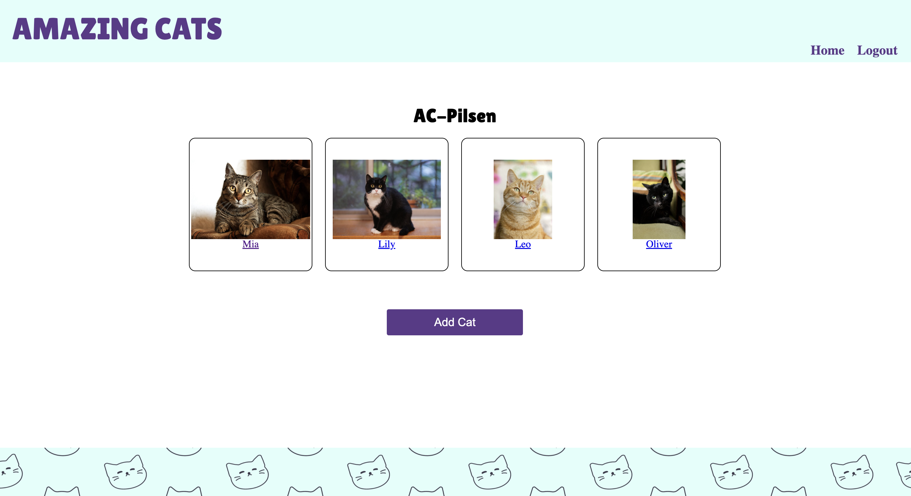

# Cat Shelter

Full stack application that allow shelter staff to manage the cats available for adoption. 

## How To Access
Please use the info below:
```
 Username: AC-Loop
 Password: password12345
```
## Live Link
https://cat-shelter-8ba255716a84.herokuapp.com/



## Description
This site is not designed to be a customer facing site but rather a resource for employees of a shelter to check on how many cats and the availability of those cats for adoption. Upon opening the site, the user will be prompted to login. After login, all the shelter locations will be displayed. The user can select and individual shelter by clicking. A page displaying all the cats current housed at that location will be displayed. Additionally, on this page, a newly arrived cat can be added to the roster. By clicking on the individual pet, a brief bio will be displayed. Additionally, on this page, once a cat had been placed in a forever home, that cat can be deleted from the database.

## Technologies
- Node.js and Express.js as server languages
- MySQL and Sequelize for the database
- bcrypt for password confidentiality
- Imgur for pictures
- dotenv 

## Credits
- Ingrid Miranda - (https://github.com/ingridmidia)
- Caroline Hartwell - (https://github.com/chart099)
- Eric Olson - (https://github.com/ericolson1977)
- Chris Kirkley - (https://github.com/Peaky00)